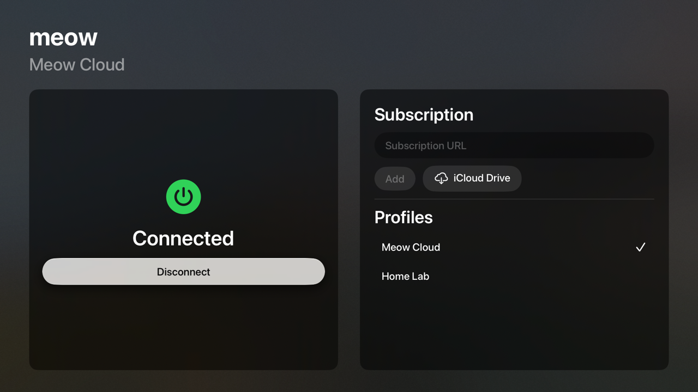
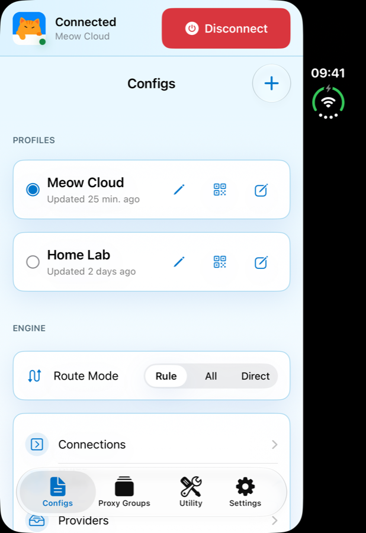
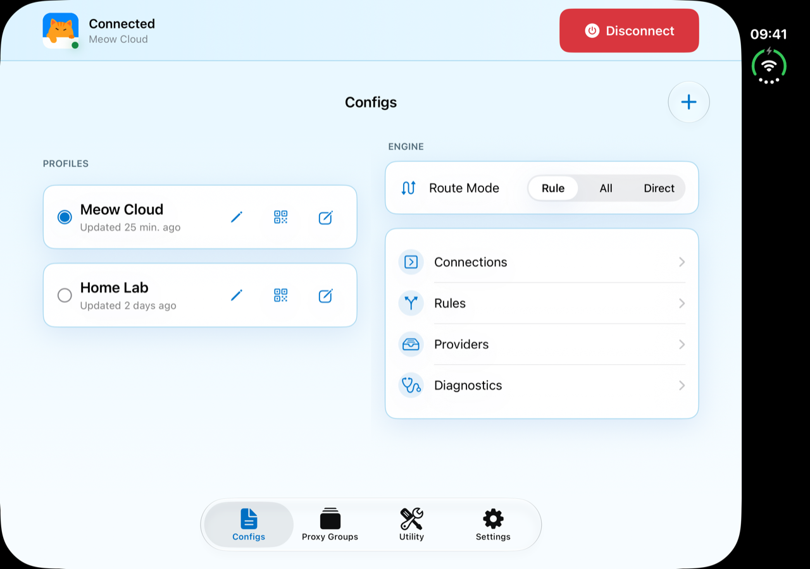

# meow-ios

Native iOS port of the Android "meow" VPN/proxy client. Full meow-rs proxy engine
wrapped in a SwiftUI material UI with a NetworkExtension packet
tunnel provider.

## Install

[](https://apps.apple.com/us/app/meow-smart-vpn/id6778303404)
[](https://testflight.apple.com/join/HSptQN3h)

Available on the App Store:
<https://apps.apple.com/us/app/meow-smart-vpn/id6778303404>. Want the latest
builds early? The public beta is open on TestFlight:
<https://testflight.apple.com/join/HSptQN3h>.
Requires iOS 18 or later (iPhone, iPad, and iPhone Duo). Bring your own Mihomo / Clash
subscription — meow does not provide proxy servers.

Latest version: **2.0** (October 2026) — meow for Apple TV (send a config
from your iPhone through iCloud), Home Screen / Lock Screen / Control Center
widgets, subscriptions that update themselves, iPad and iPhone Duo layouts,
crash reports under Settings › Diagnostics, and the meow-rs 0.21.2 engine
(BoringSSL-only TLS, Hysteria2 on quiche, XHTTP transport). See the
[release notes](https://github.com/meow-rs/meow-ios/releases) for per-version
changelogs.

## Screenshots

**Apple TV** — the same config, relayed from your iPhone through iCloud:



**iPhone Duo** — the outer display keeps the phone layout; unfolded, the inner
display lays Configs, Engine and Proxy Groups out in two columns that reflow
live across the fold:

<p>


</p>

## Status

Live on the
[App Store](https://apps.apple.com/us/app/meow-smart-vpn/id6778303404) (2.0 for iPhone and
iPad; the first Apple TV version is in App Review), with the public beta
continuing on TestFlight. See [`docs/PRD.md`](docs/PRD.md) and
[`docs/PROJECT_PLAN.md`](docs/PROJECT_PLAN.md) for the product spec and task
breakdown.

## Layout

```
App/              SwiftUI app target
PacketTunnel/     NEPacketTunnelProvider extension target
Widgets/          Home Screen widgets (WidgetKit extension target)
MeowShared/       Swift package shared between the app and its extensions
MeowCore/         Unified C header + XCFramework for the Rust native lib
core/rust/        meow-ios-ffi (meow-rs engine + tun2socks + DoH)
scripts/          Build scripts for the native lib and Xcode project
docs/             PRD, project plan, build docs
```

## Building

The Xcode project is generated from `project.yml` via
[`xcodegen`](https://github.com/yonaskolb/XcodeGen):

```sh
brew install xcodegen
./scripts/generate-xcodeproj.sh
```

The native library is built separately and wrapped as a single XCFramework
that both the app and extension link against:

```sh
./scripts/build-rust.sh   # → MeowCore/Frameworks/MeowCore.xcframework
```

See [`docs/BUILD.md`](docs/BUILD.md) for toolchain requirements.

## License

[MIT](LICENSE) © 2026 Max Lv
